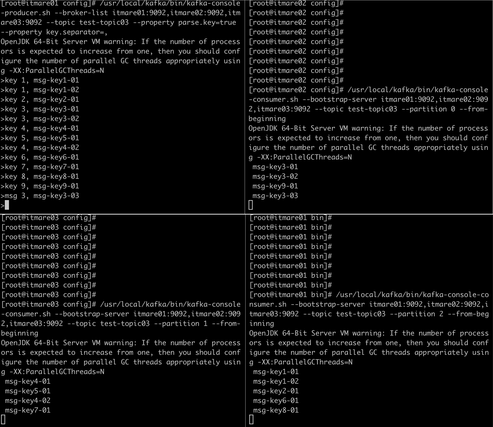
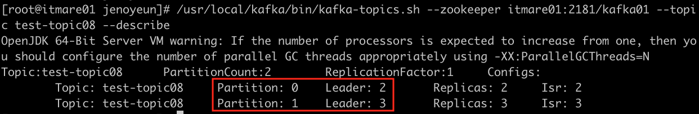
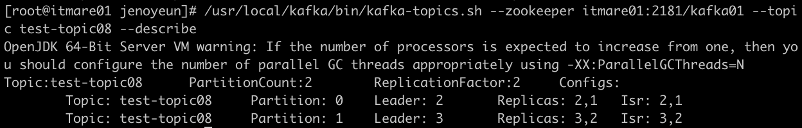
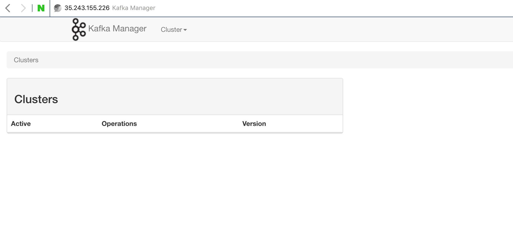
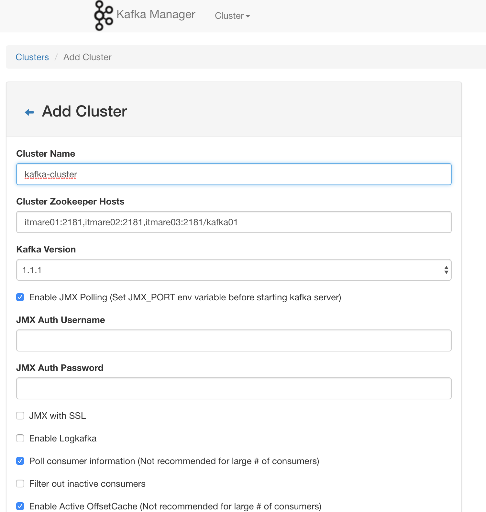
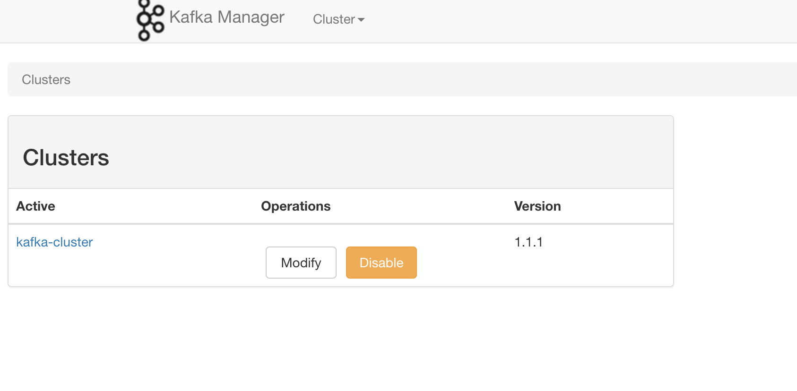
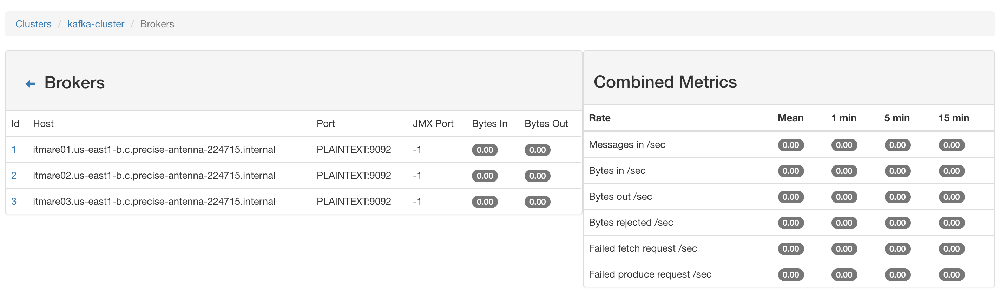
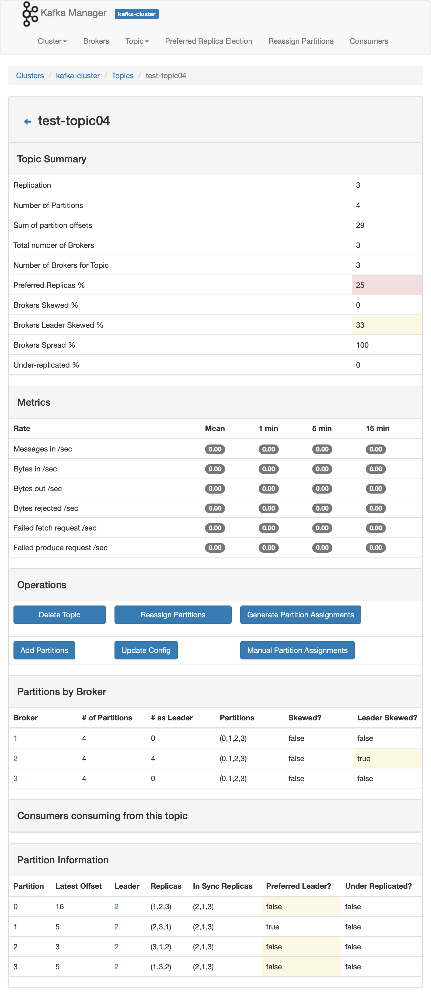

kafka 정리중

Zookeeper 설치하기
------------------

-	JDK/wget설치 (모든서버)

```shell
yum -y install java-1.8.0-openjdk
yum -y install java-1.8.0-openjdk-devel
yum -y install wget
```

-	zookeeper 설치 (모든서버)

```shell
# 설치 경로 이동
cd /usr/local
# zookeeper 다운로드
wget http://apache.mirror.cdnetworks.com/zookeeper/stable/zookeeper-3.4.12.tar.gz
# 압축 해제
tar -zxvf zookeeper-3.4.12.tar.gz
# symlink 설정
ln -s zookeeper-3.4.12.tar.gz zookeeper
# 서버 id 설정
mkdir /data
echo "1" > /data/myid # for node 1
echo "2" > /data/myid # for node 2
echo "3" > /data/myid # for node 3
```

```shell
# 샘플파일 사용위해 복사
cd zookeeper/conf
cp zoo_sample.cfg zoo.cfg
#
vi /usr/local/zookeeper/conf/zoo.cfg

tickTime=2000
initLimit=10
syncLimit=5
dataDir=/data
clientPort=2181
autopurge.snapRetainCount=3
autopurge.purgeInterval=1
server.1=itmare01:2888:3888
server.2=itmare02:2888:3888
server.3=itmare03:2888:3888
```

-	시작 및 상태확인

```shell
/usr/local/zookeeper/bin/zkServer.sh start
/usr/local/zookeeper/bin/zkServer.sh status
```

zookeeper systemd 설정
----------------------

-	centos7 배포부터 가장 크게 변화된 것, sys V의 init를 버리고 Systemd로 바뀜
-	서버에서 효율적으로 프로세스 띄우고 관리하기 위함  
-	추가정보: [centos7 systemd](http://linux.systemv.pe.kr/centos-7-systemd-%EC%9D%B4%ED%95%B4%ED%95%98%EA%B8%B0/)

```shell
vi /etc/systemd/system/zookeeper-server.service
```

```shell
[Unit]
Description=zookeeper-server
After=network.target

[Service]
Type=forking
User=root
Group=root
SyslogIdentifier=zookeeper-server
WorkingDirectory=/usr/local/zookeeper
Restart=always
RestartSec=0s
ExecStart=/usr/local/zookeeper/bin/zkServer.sh start
ExecStop=/usr/local/zookeeper/bin/zkServer.sh stop
ExecReload=/usr/local/zookeeper/bin/zkServer.sh restart

[Install]
WantedBy=multi-user.target
```

-	설정 재시작

```shell
systemctl daemon-reload
```

-	systemctl로 zookeeper 시작하기

```
/usr/local/zookeeper/bin/zkServer.sh stop
systemctl start zookeeper-server.service
systemctl status zookeeper-server.service
systemctl enable zookeeper-server.service
```

<br><br>

kafka 설치하기
--------------

```shell
cd /usr/local
wget http://apache.mirror.cdnetworks.com/kafka/1.1.1/kafka_2.11-1.1.1.tgz
tar -zxvf kafka_2.11-1.1.1.tgz
# symlink
ln -s kafka_2.11-1.1.1.tgz
```

<br><br>

kafka 설정
----------

-	log dir 만들기

```shell
mkdir -p /data1 /data2
```

-	server.properties 수정

```shell
vi /usr/local/conf/server.properties

  broker.id=1 (2 or 3) #브로커 별로 다르게 설정
  log.dirs=/data1,/data2 #위에서 만든 경로로 설정
  offsets.topic.replication.factor=3 # 토픽의 replication 갯수
  log.retention.hours=72 # 3일 권장
  zookeeper.connect=itmare01:2181,itmare02:2181,itmare03:2181/kafka01
  # 브로커1_호스트명:포트,브로커2_호스트명:포트,브로커3_호스트명:포트/주키퍼노드명

  # 하나의 주키퍼 클러스터로 여러개의 카프카클러스터를 사용할 수 있다.
```

kafka systemctl 설정
--------------------

```shell
vi /etc/systemd/system/kafka-server.service
```

-	추가

```shell
[Unit]
Description=Kafka-server
After=network.target

[Service]
Type=simple
Restart=no
ExecStart=/usr/local/kafka/bin/kafka-server-start.sh /usr/local/kafka/config/server.properties
ExecStop=/usr/local/kafka/bin/kafka-server-stop.sh

[Install]
WantedBy=multi-user.target
```

-	systemd reload, kafka (재)시작

```shell
systemctl daemon-reload
systemctl restart kafka-server
```

-	`zkCli.sh` 실행

```shell
./usr/local/zookeeper/bin/zkCli.sh
```

-	zookeeper CLI 내에서 브로커 확인

```shell
ls /kafka01/brokers/ids # broker id list
get /kafka01/brokers/ids/1 # 추가한 브로커 아이디로 get호출
```

-	zkCli server 옵션

```shell
# 다른 주키퍼 서버에 접속 가능, 보안 필요
sh zkCli.sh -server
```

-	kafka 서버 구동 확인

```shell
systemctl status kafka-server
netstat -antp  # 2181 주키퍼포트, 9092 브로커포트
```

### kafka 기본 명령어

```shell
# 토픽 생성

/usr/local/kafka/bin/kafka-topics.sh --create --zookeeper itmare01:2181/<ZNODE> --replication-factor <N> --partitions <N> --topic <TOPIC_NAME>

# 토픽 삭제
/usr/local/kafka/bin/kafka-topics.sh --delete --zookeeper itmare01:2181/<ZNODE> --topic <TOPIC_NAME>

# 메시지 보내기
/usr/local/kafka/bin/kafka-console-producer.sh --broker-list itmare01:9092,itmare02:9092,itmare03:9092 --topic <TOPIC_NAME>

# 메시지 받기
/usr/local/kafka/bin/kafka-console-consumer.sh --bootstrap-server itmare01:9092,itmare02:9092,itmare03:9092 --topic <TOPIC_NAME>

```

### 토픽 생성

```shell
/usr/local/kafka/bin/kafka-topics.sh --create --zookeeper itmare01:2181/kafka01 --replication-factor 3 --partitions 1 --topic test-topic01
```

### 메시지 보내기

```shell
/usr/local/kafka/bin/kafka-console-producer.sh --broker-list itmare01:9092,itmare02:9092,itmare03:9092 --topic test-topic01
```

### 메시지 받기

```shell
/usr/local/kafka/bin/kafka-console-consumer.sh --bootstrap-server itmare01:9092,itmare02:9092,itmare03:9092 --topic test-topic01
# 처음부터 보고싶으면 "--from-beginning 추가"
```

### 토픽 삭제

```shell
/usr/local/kafka/bin/kafka-topics.sh --delete --zookeeper itmare01:2181/kafka01 --topic test-topic01
```

### 생성한 토픽 정보 확인

```shell
/usr/local/kafka/bin/kafka-topics.sh --zookeeper itmare01:2181/kafka01 --topic test-topic01 --describe
```

<br><br><br><br><br>

---

Producer와 Consumer
===================

---

Producer
--------

-	ack=all 사용해보기  

```shell
# 토픽 생성
/usr/local/kafka/bin/kafka-topics.sh --create --zookeeper itmare01:2181/kafka01 --replication-factor 3 --partitions 1 --topic test-topic02

# 프로듀서 콘솔 시작 with ack=all
/usr/local/kafka/bin/kafka-console-producer.sh --broker-list itmare01:9092,itmare02:9092,itmare03:9092 --topic test-topic02 --request-required-acks all

# min.insync.replicas 옵션 추가
vi /usr/local/kafka/config/server.properties
  min.insync.replicas=2

# 프로듀서 콘솔 시작 with 압축
/usr/local/kafka/bin/kafka-console-producer.sh --broker-list itmare01:9092,itmare02:9092,itmare03:9092 --topic test-topic02 --compression-codec gzip
```

-	replica 3개, partition 3개의 토픽 생성 (test-topic03)

```shell
/usr/local/kafka/bin/kafka-topics.sh --create --zookeeper itmare01:2181/kafka01 --replication-factor 3 --partitions 3 --topic test-topic03

# 확인
/usr/local/kafka/bin/kafka-topics.sh --zookeeper itmare01:2181/kafka01 --topic test-topic03 --describe
```

-	ack all 테스트 다시 준비중

<br><br>

#### key value로 메시지 전송

```shell
# key/value 프로듀서 시작
/usr/local/kafka/bin/kafka-console-producer.sh --broker-list itmare01:9092,itmare02:9092,itmare03:9092 --topic test-topic03 --property parse.key=true --property key.separator=,
```

```shell
# 브로커 1에서 파티션 0 메시지 확인
/usr/local/kafka/bin/kafka-console-consumer.sh --bootstrap-server itmare01:9092,itmare02:9092,itmare03:9092 --topic test-topic03 --partition 0 --from-beginning
# 브로커 2에서 파티션 1 메시지 확인
/usr/local/kafka/bin/kafka-console-consumer.sh --bootstrap-server itmare01:9092,itmare02:9092,itmare03:9092 --topic test-topic03 --partition 1 --from-beginning
# 브로커 3에서 파티션 2 메시지 확인
/usr/local/kafka/bin/kafka-console-consumer.sh --bootstrap-server itmare01:9092,itmare02:9092,itmare03:9092 --topic test-topic03 --partition 2 --from-beginning
```

-	테스트 결과



<br><br>

-	토픽 삭제

```shell
/usr/local/kafka/bin/kafka-topics.sh --delete --zookeeper itmare01:2181/kafka01 --topic test-topic03
```

<br><br>

Consumer
--------

-	그룹으로 컨솔 시작

.

.

.

#### 메시지 손실 테스트

-	ISR이외의 브로커 리더 허용 설정

```shell
vi config/server.properties

# 추가: 먼저 올라오는 브로커가 리더가 되도록하는 옵션
unclean.leader.election.enable = true

# 모든 브로커 재시작
systemctl restart kafka-server
```

```shell
# 테스트를 위한 파티션 하나의 토픽 생성
/usr/local/kafka/bin/kafka-topics.sh --create --zookeeper itmare01:2181/kafka01 --replication-factor 3 --partitions 1 --topic test-topic06

# 현재의 리더가 누군지 체크
/usr/local/kafka/bin/kafka-topics.sh --zookeeper itmare01:2181/kafka01 --topic test-topic06 --describe

# 리더에서 콘솔 프로듀서 시작
/usr/local/kafka/bin/kafka-console-producer.sh --broker-list itmare01:9092,itmare02:9092,itmare03:9092 --topic test-topic06
```

-	브로커1이 리더라고 가정
	1.	메시지 'a' 보내기
	2.	브로커2 다운
	3.	메시지 'b' 보내기
	4.	브로커3 다운
	5.	메시지 'c' 보내기
	6.	리더(브로커1) 다운
	7.	브로커2 올리기
	8.	메시지 'd' 보내기
	9.	모든 브로커 올리기

```shell
/usr/local/kafka/bin/kafka-console-consumer.sh --bootstrap-server itmare01:9092,itmare02:9092,peter-kafka08.foo.bar:9092 --topic test-topic06 --from-beginning
```

-	결과: 메시지 'b'와 'c' 손실

#### retention 테스트

```shell
# 새로운 토픽 생성
/usr/local/kafka/bin/kafka-topics.sh --create --zookeeper itmare01:2181/kafka01 --replication-factor 3 --partitions 4 --topic test-topic07

# config 확인
/usr/local/kafka/bin/kafka-configs.sh --entity-name test-topic07 --zookeeper itmare01:2181/kafka01 --entity-type topics --describe

# retention 설정
/usr/local/kafka/bin/kafka-configs.sh --entity-name test-topic07 --zookeeper itmare01:2181/kafka01 --entity-type topics --add-config retention.ms=600000 --alter
# ==> 보관 주기 10분 (ms=600000)으로 설정, 10분후 삭제 됨

# config 재확인
/usr/local/kafka/bin/kafka-configs.sh --entity-name test-topic07 --zookeeper itmare01:2181/kafka01 --entity-type topics --describe

# 콘솔 프로듀서 구동, 일정 간격으로 메시지 보내기
/usr/local/kafka/bin/kafka-console-producer.sh --broker-list itmare01:9092,itmare02:9092,itmare03:9092 --topic test-topic07

# 콘솔 컨슈머로 메시지 가져오기
/usr/local/kafka/bin/kafka-console-consumer.sh --bootstrap-server itmare01:9092,itmare02:9092,itmare03:9092 --topic test-topic07 --from-beginning

# ==> 개별 토픽에 대해 retention 옵션 줘서, 토픽성향에 따라 메시지 삭제 (광장히 유용)
```

-	옵션빼기

```shell
/usr/local/kafka/bin/kafka-configs.sh --entity-name test-topic07 --zookeeper itmare01:2181/kafka01 --entity-type topics --delete-config retention.ms --alter
# ===> 즉시 적용 안되고, 내부적으로 일정 인터벌이 지나야 설정값이 지워짐
```

#### consumer group 테스트

```shell
# consumer group으로 콘솔 컨슈머 시작
/usr/local/kafka/bin/kafka-console-consumer.sh --bootstrap-server itmare01:9092 --topic test-topic06 --group consumer-group01 --from-beginning

# 방금 만든 그룹에 대해 describe, 그룹아이디로 시작
/usr/local/kafka/bin/kafka-consumer-groups.sh --bootstrap-server itmare01:9092 --group consumer-group01 --describe

```

<br>

-	**클러스터 설계 시: 초반에 5분정도 돌려보고, 파티션도 늘려가면서 lag의 대략적인 평균값 확인해보자.**
-	[consumer lag checker (오픈소스)](https://github.com/linkedin/Burrow)

<br>

#### 컨슈머 체크

```shell
# 브로커에 어떤 컨슈머가 있나? (콘솔 컨슈머)
/usr/local/kafka/bin/kafka-consumer-groups.sh --bootstrap-server itmare01:9092 --list

# 특별히 컨슈머 지울일은 없지만, 지우는 방법
/usr/local/kafka/bin/kafka-consumer-groups.sh --bootstrap-server itmare01:9092 --group consumer-group01 --delete
```

<br>

-	**컨슈머에서는 컨슈머 그룹 관련해 이슈가 가장 많다.**
-	**컨슈머 그룹 만들어서 사용하는 이유**
	-	자유로운 확장
	-	리발란싱 일어나는 동안 일어나는 랙에 대처
-	오프셋이 -5일때, 파티션이 5개일때 아직 읽어가지 않은건 -1 플러스 시키면 -5 (처음에)

<br>

<br>

#### 파티션 늘리기 테스트

```shell
# 새로운 토픽 생성
/usr/local/kafka/bin/kafka-topics.sh --create --zookeeper itmare01:2181/kafka01 --replication-factor 1 --partitions 1 --topic test-topic08

# 확인
/usr/local/kafka/bin/kafka-topics.sh --zookeeper itmare01:2181/kafka01 --topic test-topic08 --describe

# 파티션 변경
/usr/local/kafka/bin/kafka-topics.sh --zookeeper itmare01:2181/kafka01 --alter --topic test-topic08 --partitions 2
# ==> 운영중에 해도 괜찮다! but, 리발란싱 일어나서 랙 생길 수 있다.
```

#### replication factor 늘리기

-	운영중인 장비인데, 브로커가 죽으면 장애, 토픽바꿀수 없을때, 이때 RF 늘리는 방법

```shell
# 우선 확인
/usr/local/kafka/bin/kafka-topics.sh --zookeeper itmare01:2181/kafka01 --topic test-topic08 --describe
```



-	파티션과 리더

```shell
# json파일 활용
vi rf.json
# 다음추가 ===> 앞 숫자만 리더랑 맞춰주고 뒷 숫자는 의미없다.
{"version":1,
"partitions":[
        {"topic":"test-topic08","partition":0,"replicas":[2,1]},
        {"topic":"test-topic08","partition":1,"replicas":[3,2]}
]}

# 다음을 실행
/usr/local/kafka/bin/kafka-reassign-partitions.sh --zookeeper itmare01:2181/kafka01 --reassignment-json-file /root/rf.json --execute
```

-	결과



<br><br><br><br><br>

---

운영 관련 툴
============

---

Kafka Manager
-------------

-	yahoo에서 개발
-	클러스터 관리 (여러대 관리 가능)
-	java 베이스
-	토픽, 오프셋, 브로커, 파티션 정보 확인 가능
-	https://github.com/yahoo/kafka-manager#kafka-manager
-	다운로드: https://github.com/yahoo/kafka-manager/releases

```shell
wget https://github.com/yahoo/kafka-manager/archive/1.3.3.22.tar.gz
tar -zxvf 1.3.3.22.tar.gz
cd kafka-manager-1.3.3.22
```

-	kafka manager를 설치하기 위한 zip file 빌드하고, 찾고, 가져와서, unzip

```shell
./sbt clean dist

...  오래 걸림 ...

[info] Done packaging.
[info]
[info] Your package is ready in /usr/local/kafka-manager-1.3.3.22/target/universal/kafka-manager-1.3.3.22.zip
[info]
[success] Total time: 172 s, completed 2019. 1. 1 오전 00:00:00
```

bin/kafka-manager -Dapplication.home=.

-	kafka manager systemd에 등록

```shell
vi /etc/systemd/system/kafkamanager-server.service
```

-	아래 추가

```shell
[Unit]
Description=KafkaManger
After=network.target

[Service]
SyslogIdentifier=kafka-manager
ExecStart=/usr/local/sbin/kafka-manager-start.sh
ExecStop=/usr/local/sbin/kafka-manager-stop.sh

[Install]
WantedBy=multi-user.target
```

-	앱 시작 위한 스크립트

```shell
vi /usr/local/sbin/kafka-manager-start.sh
```

```shell
#!/bin/bash
kafkaManagerPid=$(ps ax | grep -i kafka-manager | grep 9000 | awk '{print $1}')
kafkaManagerPidFile="/usr/local/kafka-manager/RUNNING_PID"

if [ ! -z "$kafkaManagerPidFile" ]; then
  echo "kafka-manager start"
  /bin/rm -rf $kafkaManagerPidFile
  /usr/local/kafka-manager/bin/kafka-manager -Dconfig.file=/usr/local/kafka-manager/conf/application.conf -Dhttp.port=9000
else
  echo "already kafka-manager started"
  exit 1
fi
```

-	앱 종료 위한 스크립트

```shell
vi /usr/local/sbin/kafka-manager-stop.sh
```

```shell
#!/bin/bash

kafkaManagerPid=$(ps ax | grep -i kafka-manager | grep 9000 | awk '{print $1}')
kafkaManagerPidFile="/usr/local/kafka-manager/RUNNING_PID"

if [ -z "$kafkaManagerPid" ]; then
  echo "No kafka-manager to stop"
  exit 1
else
  /bin/kill -9 $kafkaManagerPid
  /bin/rm -rf $kafkaManagerPidFile
fi
```

-	systemd 추가

```shell
vi /etc/systemd/system/kafkamanager-server.service
```

```shell
[Unit]
Description=KafkaManger
After=network.target

[Service]
SyslogIdentifier=kafka-manager
ExecStart=/usr/local/sbin/kafka-manager-start.sh
ExecStop=/usr/local/sbin/kafka-manager-stop.sh

[Install]
WantedBy=multi-user.target
```

```shell
systemctl daemon-reload
```

-	스크립트 권한 주기

```shell
cd /usr/local/sbin/
chmod u+x kafka-manager-st*
```

-	시작

```shell
systemctl start kafkamanager-server
```

-	kafka manager에 JMX 허용

```shell
# 카프카 시작시, 포트 추가
vi /usr/local/kafka/bin/kafka-server-start.sh
export JMX_PORT=9999

# 재시작
systemctl restart kafka-server
systemctl restart kafkamanager-server
```

<kbd></kbd>

<br><br>

<kbd></kbd>

<br><br>

<kbd></kbd>

<br><br>

<kbd></kbd>

<br><br>

<kbd></kbd>

<br>

<br><br><br><br><br>

---

Kafka Data Pipeline
===================

---

filebeat
--------

-	filebeat 다운로드

```shell
rpm --import https://packages.elastic.co/GPG-KEY-elasticsearch
```

<br><br><br>

NIFI
----

-	데이터 흐름을 정의하고, 정의된 흐름대로 자동으로 실행해주는 애플리케이션
-	웹 기반의 인터페이스를 제공
-	NSA(the United States National Security Agency)에서 만들어졌고, 원래 이름은 나이아가라폭포를 연상시키는 Niagarafiles
-	Hortonworks에서 리딩

<br><br><br>

ElasticSearch
-------------

-	엘라스틱의 분산형 RESTful 검색 및 분석 엔진
-	빠르다. 빠른 속도로 데이터 엑세스
-	수평적 확장이 가능
-	어떤 데이터든 가능

<br><br><br>

Kibana
------

.

.

.

.

.

.

.

.
